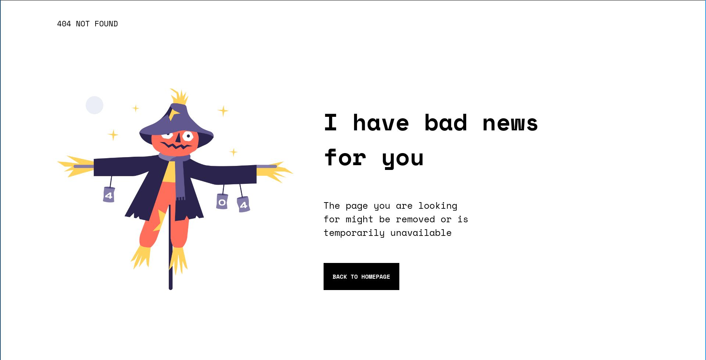

<!-- Please update value in the {}  -->

<h1 align="center">404 Webpage</h1>

   Solution for a challenge from  <a href="http://devchallenges.io" target="_blank">Devchallenges.io</a>.

  <h3>
    <a href="https://coldfix.dev/error-page.html">
      Demo
    </a>
     | 
    <a href="https://github.com/dXu23/404-not-found-challenge/blob/main/404.html">
      Solution
    </a>
     | 
    <a href="https://devchallenges.io/challenges/wBunSb7FPrIepJZAg0sY">
      Challenge
    </a>
  </h3>

<!-- TABLE OF CONTENTS -->

## Table of Contents

- [Overview](#overview)
  - [Built With](#built-with)
- [Features](#features)
- [Contact](#contact)
- [Acknowledgements](#acknowledgements)

<!-- OVERVIEW -->

## Overview

- Where can I see your demo?

Right [here](https://coldfix.dev/error-page.html)

- What was your experience?

I had a hard time finding the fonts used. Font Squirrel helped me find the font of the main text body.
However, I had to give up on the font of the '404 NOT FOUND' header since the letters were scrunched up
together. According to Font Squirrel, there is a way to separate letters scrunched up together, but I'm
too lazy to figure out how.

- What have you learned/improved?

I improved my knowledge of CSS grid and media queries.

- Your wisdom? :)

It might be a good idea to learn OpenCV/Gimp so that one can identify contours around the letters and separate them
for FontSquirrel.

### Built With

Just humble vanilla HTML and CSS.

## Features

This application/site was created as a submission to a [DevChallenges](https://devchallenges.io/challenges) challenge. 
The [challenge](https://devchallenges.io/challenges/wBunSb7FPrIepJZAg0sY) was to build an simple 404 page that would
change its layout according to screen size. 

## Acknowledgements

- [Font Squirrel font matcherator](https://www.fontsquirrel.com/matcherator)
- [CSS Grid info](https://css-tricks.com/snippets/css/complete-guide-grid/)
- [W3 Schools on Media Queries](https://www.w3schools.com/css/css_rwd_mediaqueries.asp)
- [Space Mono font](https://www.fontsquirrel.com/fonts/space-mono)

## Contact

- Website [coldfix.dev](https://coldfix.dev)
- GitHub [@dXu23](https://github.com/dXu23)

